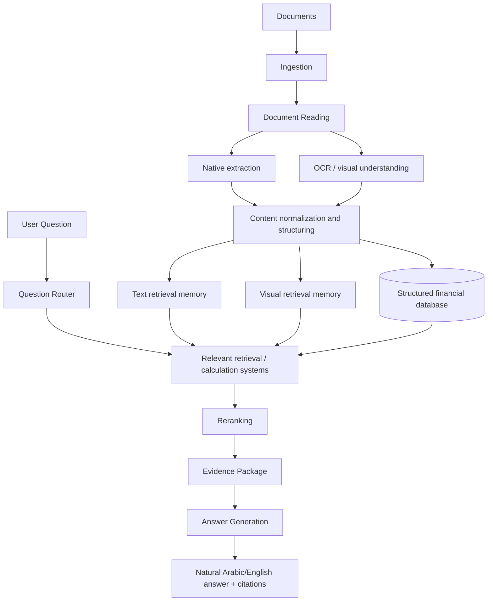

# Architecture — MizanIQ
AI-Powered Finance Document Intelligence System

> Describes HOW the system works.
> Related docs: [PROJECT_SPEC.md](PROJECT_SPEC.md) · [ROADMAP.md](ROADMAP.md) · [DEVELOPMENT_RULES.md](DEVELOPMENT_RULES.md) · [DATASET_DESIGN.md](DATASET_DESIGN.md) · [CANONICAL_DATA_MODEL.md](CANONICAL_DATA_MODEL.md) · [EVALUATION_PLAN.md](EVALUATION_PLAN.md)

## Conceptual Flow

```text
Documents
    ↓
Ingestion
    ↓
Document Reading
    ├── Native extraction
    └── OCR / visual understanding
    ↓
Content normalization and structuring
    ↓
Three information representations
    ├── Text retrieval memory
    ├── Visual retrieval memory
    └── Structured financial database
    ↓
User Question
    ↓
Question Router
    ↓
Relevant retrieval/calculation systems
    ↓
Reranking
    ↓
Evidence Package
    ↓
Answer Generation
    ↓
Natural Arabic/English answer + citations
```

### Mermaid Diagram



## The Three-Memory Concept

### 1. TEXT MEMORY

Purpose:
Semantic explanations and textual information.

Expected technologies currently under consideration:

- multilingual embeddings
- BM25 keyword search
- Qdrant vector database

Current candidate embedding families include Qwen multilingual embeddings and BGE-M3.

Do NOT hard-lock an exact model until benchmarking is performed.

### 2. VISUAL MEMORY

Purpose:
Retrieve complete visual evidence such as:

- charts
- page screenshots
- scanned tables
- invoices
- document layouts
- images

Possible technology under evaluation:
ColQwen-style document visual retrieval.

A visual-language model such as a suitable Qwen-VL family model may later inspect retrieved images.

Again, models should be selected through benchmarking rather than permanently assumed.

### 3. STRUCTURED FINANCIAL DATABASE

Purpose:
Store clean, validated financial records.

Current database choice:
DuckDB.

Examples of stored fields:

```text
year
metric
value
currency
document_id
page/source
```

DuckDB should handle deterministic numerical calculations whenever possible.

## Why Three Representations Are Required

- Text retrieval = meaning
- Visual retrieval = appearance / layout / images
- DuckDB = exact numerical truth / calculations

No single representation can cover all three needs:

- Semantic search cannot guarantee exact arithmetic.
- A SQL database cannot explain management commentary or interpret a chart image.
- Image retrieval cannot answer "what was revenue in 2023?" with a validated number.

The three memories are complementary and are combined at answer time via the router, reranker, and evidence package.

## Question Router

The router determines which system(s) a question needs.

Examples:

- "What did management say about expenses?"
  → text retrieval

- "Show me the revenue chart."
  → visual retrieval

- "What was revenue in 2023?"
  → structured database

- "Why did expenses increase by 25%?"
  → database calculation + text retrieval

- "Forecast revenue for the next year."
  → forecasting

Many real questions require a combination (for example, a verified number from DuckDB plus a textual explanation from retrieved passages).

## Hybrid Retrieval

Semantic embeddings and BM25 should complement one another.

Semantic search:
good for concepts and multilingual meaning.

BM25:
good for exact identifiers, invoice numbers, account codes and literal terms.

Neither method alone is sufficient for financial documents, where a user may ask a conceptual question in Arabic about a passage written in English, or may ask for an exact invoice number that must match literally.

## Reranking

Initial retrieval should collect candidates quickly.

A reranker should then select the strongest evidence.

Only the strongest relevant evidence should be sent to answer generation.

This keeps the answer-generation prompt focused, reduces noise and hallucination risk, and controls cost/latency.

## Evidence Package

The backend may internally build structured evidence containing:

- question
- calculations
- retrieved text
- retrieved images
- source filenames
- page numbers

The USER SHOULD NOT see raw internal JSON.

The user should see a natural answer with citations.

The evidence package is the contract between retrieval/calculation and answer generation: generation must be grounded in it, and must declare insufficient evidence when the package does not support an answer.

## Forecasting Architecture

```text
Structured financial data
→ time-series preparation
→ baseline/model training
→ backtesting/evaluation
→ best validated model
→ forecast
→ optional LLM explanation
```

The LLM does NOT generate the forecast numbers.

Forecasts come from validated statistical/time-series methods trained on DuckDB records. The LLM may only explain, in Arabic or English, what the validated model produced.

## Implementation Status — Ingestion (Phase 1)

The `Ingestion` box above is implemented natively in `src/ingestion/`:
deterministic routing (extension + magic bytes), one normalized
Document/Element model with provenance, per-format parsers (pypdf +
pdfplumber-lattice for PDF, python-docx, openpyxl, stdlib csv, Pillow
metadata), and explicit native/OCR/visual classification. OCR, embeddings,
retrieval, and answer generation remain future phases. Details:
[INGESTION_DESIGN.md](INGESTION_DESIGN.md).
